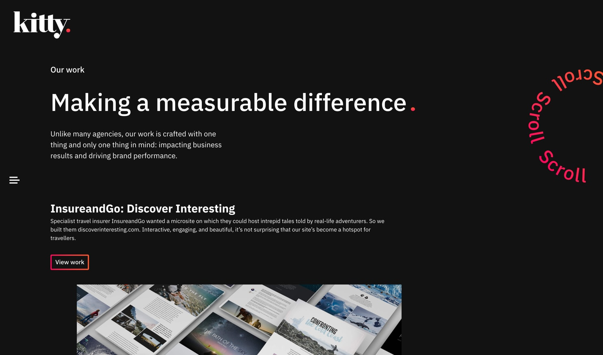

A WordPress site that utilises smooth page transitions and animations throughout to provide a memorable user experience.

The intention of the site was to present the creative agency "Kitty" in a much more modern and animated way. There were a few creative constraints around the use of technology; it had to be WordPress, but it had to interact and function much more like a SPA might.

With these constraints in mind, the website functions behind the scenes like a traditional website will. However, with the use of a few different JavaScript based techniques, I was able to get each page load happening in the background while the user is shown a transition, and then served the updated content. The backend still operated as a WordPress site would, so the content team had no issues in their day to day work.

I spent a lot of time around the animations on this project, getting things to feel "just right" at the time. After the main bread and butter animations were completed such as the menu, defined content and page transitions, it was time to move on to the small pieces that really make a website feel much more professional.

These included some playful interactive animations, such as a spinning scroll animation that reacted to the user moving around the page. In my opinon, this seemingly small things can add a lot to a user's overall experience on such a creative website.
